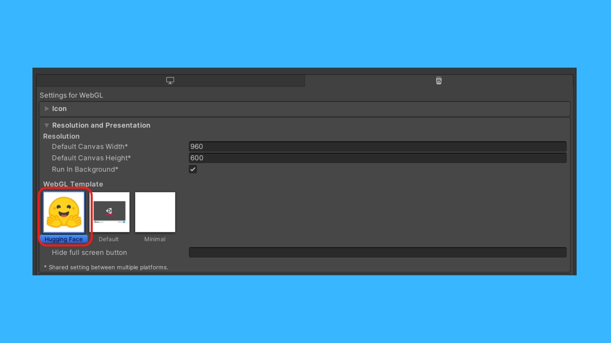
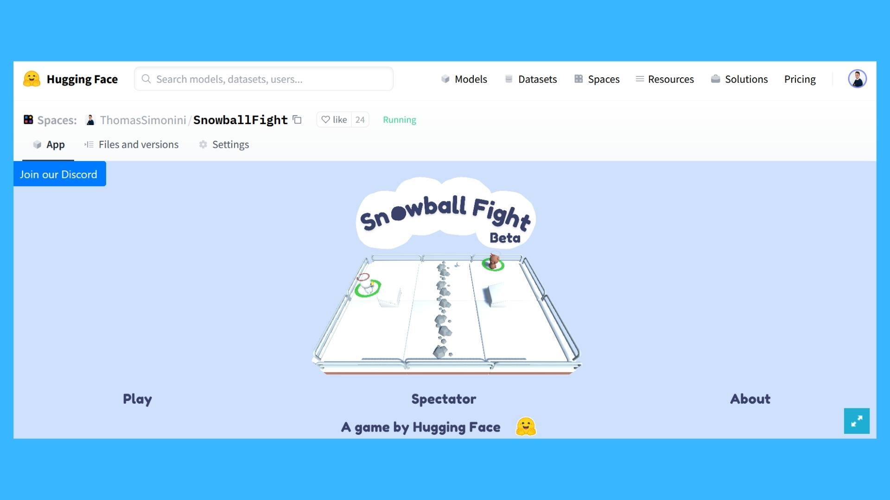

# Hugging Face Unity WebGL Template for Spaces

This WebGL template allows you to build and publish your demo on [Hugging Face Spaces](https://huggingface.co/spaces).

This template is based on the work of [greggman](https://greggman.github.io/better-unity-webgl-template/)

## Instructions
- Download the Unity Package and place it into your project.
- In `Edit> Project Settings > Player`, in the WebGL tab under *Resolution and Presentation* pick "Hugging Face" template.

- You can change the loading logo in `Assets/WebGLTemplates/Hugging Face/logo.png`

